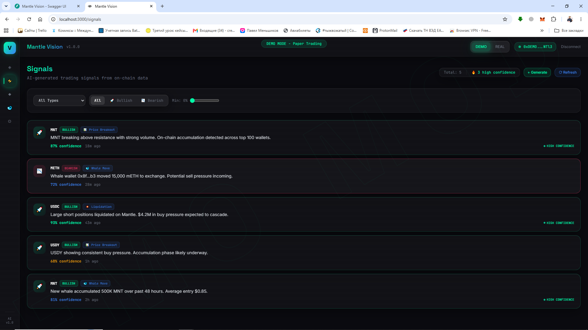
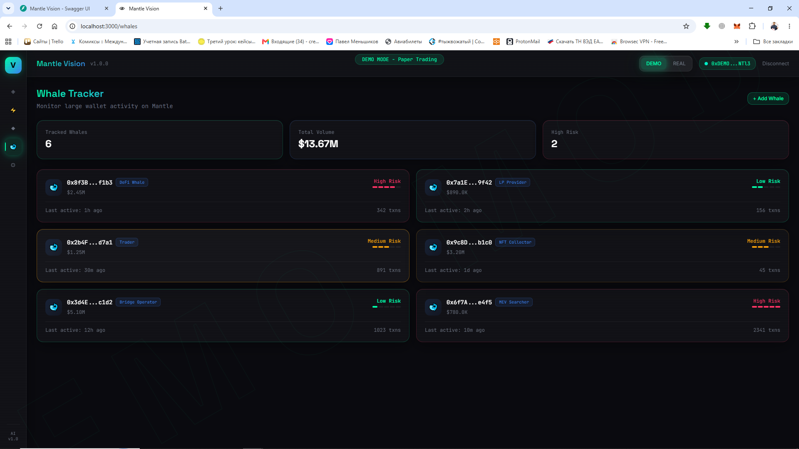

# Mantle Vision

**Autonomous AI Trading Agent for Mantle Network**

[](https://mantle.xyz)
[](https://dorahacks.io/hackathon/mantle-turing-test)
[](https://dorahacks.io/hackathon/mantle-turing-test)

[](https://vuejs.org/)
[](https://fastapi.tiangolo.com/)
[](https://soliditylang.org/)
[](https://tailwindcss.com/)
[](https://openai.com/)
[](https://altllm.ai/)
[](LICENSE)

---

<p align="center">
  <b>Real-time on-chain intelligence • AI-powered trading signals • Autonomous paper trading • Telegram alerts</b>
</p>

<p align="center">
  <i>An entry for the Mantle Turing Test Hackathon 2026 — Phase II: AI Awakening</i>
</p>

---

## Overview

Mantle Vision is an autonomous AI agent that monitors the Mantle blockchain in real time, analyzes whale movements and DeFi activity, generates trading signals, and executes paper trades — all without human intervention. It features a cyberpunk-styled dashboard and a Telegram bot for mobile notifications.

### Tracks & Prizes
| Track | Prize | Target |
|-------|-------|--------|
| **AI Alpha & Data** | $8,500 | On-chain AI analysis |
| **AI Trading & Strategy** | $3,500 | Autonomous trading agent |
| **Best AI Agent** | $200 | Agent usability & innovation |
| **Best UI/UX** | $3,000 | Dashboard experience |

---

## Screenshots

### Dashboard
Real-time portfolio value, P&L, active signals, and network status — all in one place.


### Signals
AI-generated trading signals with direction, confidence score, and reasoning from each analysis cycle.


### Whales
On-chain whale tracking — live blockscan for large transfers and protocol interactions on Mantle.


---

## Features

### 🤖 Autonomous Trading Agent
- Scans Mantle blocks every 120s for whale transfers & protocol interactions
- AI analysis with 3-provider fallback chain: **OpenAI → Groq → AltLLM**
- Autonomous BUY/SELL/HOLD decisions based on real on-chain data
- Paper trading engine with $10K virtual capital, live P&L tracking
- **10 AI API calls per cycle** (3 assets × 3 analyses + 1 summary)

### 📊 Live Dashboard
- Real-time signal feed with confidence indicators
- Portfolio positions & performance chart
- Whale activity monitor
- Token price ticker (CoinGecko)

### 📱 Telegram Notifier
- Trade execution alerts
- Whale movement warnings
- AI signal notifications
- Agent status reports

### ⛓️ On-Chain Identity (ERC-8004)
- Agent registration on Mantle via ERC-8004 contract
- Verified on-chain signal recording
- Accuracy tracking

---

## Architecture

```
mantle-vision/
├── frontend/                      # Vue 3 + Vite + Tailwind
│   ├── src/
│   │   ├── components/           # GlassCard, NeonButton, SignalCard, WalletConnect...
│   │   ├── views/                # Dashboard, Signals, Portfolio, Whales, Settings
│   │   ├── stores/               # Pinia: wallet, signals, portfolio
│   │   └── composables/          # WebSocket real-time client
│   └── vite.config.js            # Proxy to backend :8000
│
├── backend/                       # FastAPI + AI + Blockchain
│   ├── app/
│   │   ├── api/                  # REST: /signals, /whales, /portfolio, /auth, /ws
│   │   ├── services/
│   │   │   ├── mantle_scanner.py # Real Mantle block scanner
│   │   │   ├── nansen.py         # Whale tracking (real data fallback)
│   │   │   ├── analyzer.py       # AI analysis (OpenAI → Groq → AltLLM)
│   │   │   ├── trading_agent.py  # Autonomous decision engine
│   │   │   ├── dex_trader.py     # On-chain DEX swap execution
│   │   │   ├── paper_trading.py  # Virtual portfolio engine
│   │   │   ├── price_feed.py     # Live CoinGecko prices
│   │   │   └── telegram_bot.py   # Telegram notification service
│   │   ├── blockchain/           # Mantle RPC client & contract interactions
│   │   └── models/               # Pydantic schemas
│   └── requirements.txt
│
├── contracts/                     # Solidity
│   ├── AgentIdentity.sol         # ERC-8004 agent identity
│   └── SignalRecorder.sol        # On-chain signal ledger
│
├── .env.example                   # Environment template
└── README.md
```

---

## Quick Start

### Prerequisites
```bash
# Backend
cd mantle-vision/backend
pip install -r requirements.txt

# Frontend
cd mantle-vision/frontend
npm install
```

### Configure Environment
```bash
cp .env.example .env
# Edit .env with your API keys (see .env.example for required fields)
```

### Run
```bash
# Terminal 1 — Backend (FastAPI)
cd mantle-vision/backend
uvicorn app.main:app --reload --port 8000
# → http://localhost:8000/docs

# Terminal 2 — Frontend (Vue 3)
cd mantle-vision/frontend
npm run dev
# → http://localhost:3000
```

### Verify
```bash
curl http://localhost:8000/health
# → {"status":"ok","blockchain":"mantle","block":39541546,"mode":"demo"}
```

---

## API Endpoints

| Method | Path | Description |
|--------|------|-------------|
| GET | `/health` | Server status & current block |
| GET | `/api/signals` | List signals (paginated, filterable) |
| GET | `/api/signals/{id}` | Signal details |
| POST | `/api/signals/generate` | Generate AI signal |
| GET | `/api/whales` | List tracked whales |
| POST | `/api/whales` | Add whale address |
| DELETE | `/api/whales/{address}` | Remove whale |
| GET | `/api/whales/{address}/activity` | Whale activity feed |
| GET | `/api/portfolio` | Portfolio positions |
| GET | `/api/portfolio/pnl` | P&L history chart data |
| GET | `/api/portfolio/history` | Trade history |
| POST | `/api/portfolio/trade` | Execute paper trade |
| GET | `/api/auth/nonce/{address}` | Get SIWE nonce |
| POST | `/api/auth/verify` | Verify wallet signature |
| GET | `/api/auth/session` | Check session validity |
| WS | `/ws` | Real-time signal stream |

---

## AI Provider Fallback Chain

```
┌─────────┐    ┌────────┐    ┌──────────┐    ┌───────────┐
│ OpenAI  │ →  │  Groq  │ →  │  AltLLM  │ →  │ Fallback  │
│ GPT-4o  │    │Mixtral │    │crypto-ai │    │determin.  │
└─────────┘    └────────┘    └──────────┘    └───────────┘
```

| Provider | Key Status | Model | Cost | Specialty |
|----------|-----------|-------|------|-----------|
| OpenAI | ✅ | `gpt-4o-mini` | ~$0.15/1M tokens | JSON mode, structured output |
| Groq | ✅ | `mixtral-8x7b-32768` | Free | Fast inference |
| AltLLM | ✅ | `altllm-basic` | $5/1M tokens | Built-in CoinGecko, crypto news, gas data |

---

## Smart Contract Addresses

| Contract | Address | Network |
|----------|---------|---------|
| AgentIdentity (ERC-8004) | *TBD — deploy after Phase II* | Mantle Sepolia |
| SignalRecorder | *TBD — deploy after Phase II* | Mantle Sepolia |

---

## Tech Stack


**Frontend:** Vue 3, Vite, Tailwind CSS, Pinia, Chart.js, Ethers.js  
**Backend:** FastAPI, Uvicorn, Web3.py, OpenAI SDK, httpx, aiogram  
**Contracts:** Solidity 0.8.20, OpenZeppelin, ERC-721 (ERC-8004)  
**Blockchain:** Mantle Network (EVM L2) — Sepolia testnet  

---

## Environment Variables

See [`.env.example`](.env.example) for the complete list.

---

## Roadmap

### Phase 1 — Core Architecture (in progress)
- [x] Real-time on-chain scanner (Mantle blocks, whale transfers, protocol interactions)
- [x] 3-provider AI fallback chain (OpenAI → Groq → AltLLM)
- [x] Paper trading engine ($10K virtual capital)
- [x] Live dashboard + Telegram alerts
- [ ] **Strategy layer** — RSI, Volume Anomaly, Nostalgia patterns
- [ ] **WhaleScore** — mathematical scoring of whale activity
- [ ] **AI arbiter** — strategies compute for free, AI only says YES/NO
- [ ] **Database (SQLite)** — persistent history for all users

### Phase 2 — Infrastructure
- [ ] Docker: single `docker-compose up`
- [ ] MetaMask wallet auth (browser-based, no .env keys)
- [ ] UI fixes: theme toggle, refresh, reconnect

### Phase 3 — Sponsor APIs (awaiting Twitter restore)
- [ ] Nansen AI — whale intelligence
- [ ] Elfa AI — social sentiment
- [ ] Surf AI — additional AI compute
- [ ] Orbit AI — agent tooling

### Phase 4 — Production
- [ ] Real DEX trading on Mantle (user's own wallet)
- [ ] Backtesting dashboard
- [ ] Strategy leaderboard

---

## License

MIT

---

<p align="center">
  Built with ☕ and ❤️ for <a href="https://dorahacks.io/hackathon/mantle-turing-test">Mantle Turing Test Hackathon 2026</a> • Phase II: AI Awakening
</p>
