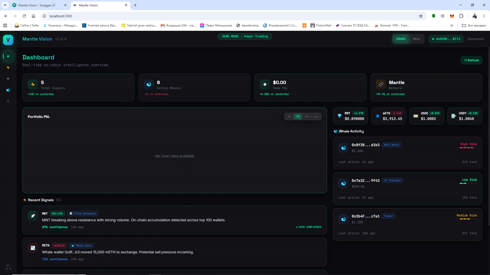

# Mantle Vision

**On-Chain Wallet Intelligence for Mantle Network**

[](https://mantle.xyz)
[](https://dorahacks.io/hackathon/mantle-turing-test)

[](https://vuejs.org/)
[](https://fastapi.tiangolo.com/)
[](https://tailwindcss.com/)
[](https://openai.com/)
[](https://altllm.ai/)
[](LICENSE)

---

<p align="center">
  <b>Man-in-the-loop intelligence.</b> Not a trading bot. Not a copy trader.</br>
  We highlight anomalies, map wallet connections, assess risk — <i>you</i> decide.
</p>

---

## Why not another trading bot?

Every crypto hackathon has 20 "AI trading bots". Ours isn't one.

Mantle Vision is an **investigation tool**. You see a suspicious wallet in a transaction — paste the address and get:
- **Who funded it** — funding tree (who sent money to whom)
- **What type it is** — CEX wallet? Insider cluster? Fresh setup? Smart money?
- **Risk score** — mathematical + ML-based anomaly detection
- **Cluster connections** — linked wallets, insider networks
- **AI summary** — one-line plain English explanation
- **Recent activity** — last transactions on Mantle

The only "signal" we generate is **insider detection** — if we find a wallet behaving like an insider (funded just before a protocol event, coordinated moves), we flag it. Everything else is just intelligence for you to act on.

> **Man-in-the-loop.** The tool watches. The AI analyzes. The human decides.

---

## What it does

| Feature | Description |
|---------|-------------|
| **Wallet Analysis** | Paste any Mantle address → risk score, wallet type, tags, AI summary |
| **Funding Tree** | Visual graph of who funded whom — trace money flow |
| **Cluster Detection** | Insider wallet networks, connected addresses |
| **Anomaly Detection** | Isolation Forest + rule-based flags for suspicious behavior |
| **Transaction Stream** | Live Mantle transactions with AI anomaly highlighting |
| **Whale Watchlist** | Track specific addresses, get cluster context |
| **Telegram Bot** | Alerts on anomalies, insider clusters, whale movement |

---

## Screenshots

### Wallet Intelligence
Search any address — risk score, type, AI summary, and funding tree.


### Funding Tree
Visual graph of wallet connections — who funded whom.


### Transaction Stream
Live Mantle blocks with AI-flagged anomalies highlighted in red.


---

## Architecture

```
mantle-vision/
├── frontend/                        # Vue 3 + Vite + Tailwind
│   ├── src/
│   │   ├── components/              # GlassCard, NeonButton, TransactionStream, FundingTree...
│   │   ├── views/                   # Dashboard, Wallet, Transactions, Whales, Settings
│   │   ├── stores/                  # Pinia: auth, signals, wallet, theme
│   │   └── router/                  # Vue Router with auth guards
│   └── vite.config.js               # Proxy to backend :8000
│
├── backend/                         # FastAPI + AI + Blockchain
│   ├── app/
│   │   ├── api/                     # /wallet, /signals, /whales, /auth, /txs
│   │   ├── services/
│   │   │   ├── wallet.py            # Wallet Analysis API
│   │   │   ├── cluster_analyzer.py  # Wallet cluster detection
│   │   │   ├── anomaly_detector.py  # Isolation Forest anomaly detection
│   │   │   ├── whale_score.py       # Multi-factor wallet scoring
│   │   │   ├── analyzer.py          # AI (OpenAI → Groq → AltLLM)
│   │   │   ├── mantle_scanner.py    # Real Mantle block scanner
│   │   │   ├── knowledge_base.py    # Pattern matching
│   │   │   ├── price_feed.py        # CoinGecko prices
│   │   │   └── telegram_bot.py      # Telegram alerts
│   │   ├── models/                  # Pydantic schemas
│   │   └── database.py              # SQLite persistence
│   └── requirements.txt
│
├── contracts/                       # Solidity (ERC-8004 agent identity)
├── docs/images/                     # Screenshots
├── .env.example
└── docker-compose.yml
```

---

## Quick Start

```bash
git clone https://github.com/PavelMenshikov/Mantle-Vision.git
cd mantle-vision

# Backend
cd backend
pip install -r requirements.txt
cp ../.env.example .env  # Add your API keys
uvicorn app.main:app --reload --port 8000

# Frontend (separate terminal)
cd frontend
npm install
npm run dev
```

Open [http://localhost:3000](http://localhost:3000) — log in with MetaMask or Telegram, then paste any Mantle address into the search bar.

---

## Deployed Contracts (Mantle Sepolia)

| Contract | Address | Explorer |
|----------|---------|----------|
| **AgentIdentity** | `0x77a5CeADd28E23C1fFA85ED4814Bf29C8c31F21f` | [View](https://sepolia.mantlescan.xyz/address/0x77a5CeADd28E23C1fFA85ED4814Bf29C8c31F21f) |
| **SignalRecorder** | `0xcb96A0892E8b45B0aF94B77cEc7D133daaEb1ce9` | [View](https://sepolia.mantlescan.xyz/address/0xcb96A0892E8b45B0aF94B77cEc7D133daaEb1ce9) |

Network: **Mantle Sepolia** (Chain ID: **5003**)  
Telegram bot: [@dorahacksmantle_bot](https://t.me/dorahacksmantle_bot) — get real-time alerts on anomalies and whale movements.

---

## API

| Method | Path | Description |
|--------|------|-------------|
| GET | `/health` | Server status |
| GET | `/api/wallet/{address}/analysis` | Full wallet profile (risk, type, tags, signals) |
| GET | `/api/wallet/{address}/funding-tree` | Funding connections graph |
| GET | `/api/wallet/{address}/summary` | AI one-line wallet summary |
| GET | `/api/wallet/{address}/transactions` | Recent wallet transactions |
| GET | `/api/signals` | Insider/anomaly signals |
| GET | `/api/whales?user_id=...` | User's whale watchlist |
| POST | `/api/whales` | Add address to watchlist |
| GET | `/api/txs/recent` | Live transaction stream |
| GET | `/api/auth/nonce/{address}` | SIWE authentication |
| POST | `/api/auth/verify` | Verify wallet signature |
| WS | `/ws` | Real-time signal stream |

---

## How wallets are scored

| Type | How detected | What it means |
|------|-------------|---------------|
| **Insider** | Cluster analysis + funding patterns | Connected to known insider addresses |
| **Anomaly** | Isolation Forest ML model | Statistical outlier in tx behavior |
| **Smart Money** | Historical pattern matching | Behaves like experienced traders |
| **CEX** | Tag-based + interaction patterns | Exchange deposit/withdrawal wallet |
| **Fresh** | No history, small test txns | New wallet, possible reconnaissance |
| **Clean** | No red flags | Normal activity patterns |

Risk score combines: wallet age, tx frequency, value moved, cluster membership, anomaly score, exchange interaction.

---

## Roadmap

### Phase 1 — Core ✅
- [x] Mantle blockchain scanner
- [x] Wallet clustering + anomaly detection
- [x] Wallet reputation scoring
- [x] AI analysis (OpenAI → Groq → AltLLM)
- [x] Telegram alerts

### Phase 2 — Wallet Intelligence ✅
- [x] Wallet Analysis API + UI
- [x] Funding tree visualization
- [x] AI wallet summaries
- [x] Transaction stream with anomaly highlighting
- [x] Per-user workspace
- [x] Lucide icon system

### Phase 3 — Live Intelligence
- [ ] Force-directed cluster graph (D3.js)
- [ ] Live wallet feed — subscribe to address activity
- [ ] Wallet report export (PDF / shareable link)
- [ ] Telegram alerts on watched wallets
- [ ] Historical activity replay

### Phase 4 — Ecosystem
- [x] ERC-8004 agent identity deployment (AgentIdentity + SignalRecorder on Sepolia)
- [ ] Nansen API integration ($7K sponsor credits)
- [ ] Elfa AI social sentiment ($36K credits)
- [ ] Community wallet tagging

---

## Tech Stack

**Frontend:** Vue 3, Vite, Tailwind CSS, Pinia, Lucide Icons  
**Backend:** FastAPI, Web3.py, OpenAI SDK, scikit-learn, NetworkX  
**AI:** OpenAI GPT-4o-mini, Groq Mixtral, AltLLM (crypto-native)  
**Blockchain:** Mantle Network (EVM L2) — Sepolia (Chain ID: 5003)  
**Infra:** Docker, SQLite, WebSocket

---

<p align="center">
  Built with ☕ and ❤️ for <a href="https://dorahacks.io/hackathon/mantle-turing-test">Mantle Turing Test Hackathon 2026</a><br/>
  <i>Free tool. Man-in-the-loop. No trading signals. Just intelligence.</i>
</p>
